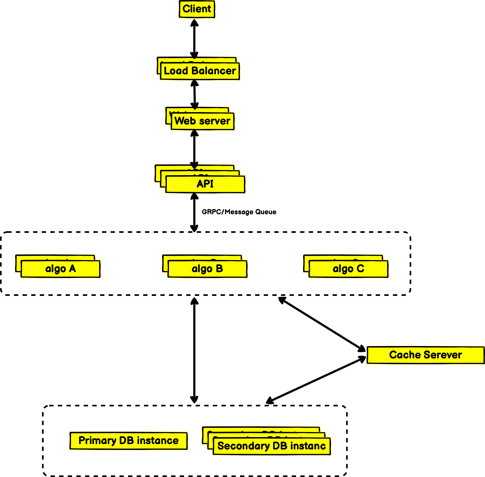

# Enpicom

Both backend & frontend directories got their own `readme.md` file and contain setup instruction.

## Requirements

I'm assuming the DNA sequence cloud be a bit longer rather than a small string and it needs to be indexed for faster search. And search terms without Levenshtein distance should be an exact match, also I feel like there should be some limitation for Levenshtein distance like I limited for 1-1000.

## How to scale it

The current backend design will work for certain limits of network traffic, for the first search I've indexed the sequence column. If the service gets lots of traffic & the sequence string is big it will raise some problems. Database index data size will be huge which will cost more expenses, big index data will take more time to create & update. And If in the future we needed to break the database table into multiple servers It will add lots of latency because of the long shard key.

We can deal with this problem by using hashing mechanism, by using a unique hash key for each record. Keeping a small hash key for a long sequence, so this small key will be easier to index & create database sharding if needed. So when the user will send a sequence create request we will generate & store a hash key based on the sequence. When users send a search request to our service we will hash search sequence and make DB queries with that hash key. For generating hash keys we can use base64 encoding or others maybe.

We can increase the number of application instances and place a load balancer on top of these. If we get lots of read requests in DB, we can redirect some read queries to the secondary instance. And if index data and working dataset do not fit into in-memory we can split the database table into multiple servers. Database instances also can have a query load balancer.

And lastly, we can cache some of hot search, so that our database doesn't get any hit.

## System design for multi-type processing

In the following steps, I tried to explain the system design for this service.

### Requirement assumption

Functional:

- same input data will be processed by differents algorithm based on input type

Non-Functional:

- The system should be highly available.

### 2. Capacity Estimation

Our system will process heavy.

#### Traffic estimation

Assuming we will have 500M data processing requests per month. So data processing request per second

```bash
500 million / (30 days * 24 hours * 3600 seconds) = ~200 URLs/s
```

#### Storage estimation

Let's assume we store every data record for 1 year. Since we expect to have 500M data processing request every month, the total number of objects we expect to store will be 6 billion:

```bash
500 million * 12 months = 6 billion
```

Let’s assume that each stored object will be approximately 200 bytes. We will need 1.2TB of total storage:

```bash
6 billion * 200 bytes = 1.2 TB
```

#### Bandwidth estimation

Since we expect 200 requests per second, the total incoming data for our service will be 20KB per second:

```bash
200 * 100 bytes = 20 KB/s
```

If we assume each request will response 50 bytes of response data then, Total outgoing data for our service would be 10KB per second:

```bash
200 * 50 bytes = 10 KB/s
```

### 3. Architecture

I will put different algorithms into small micro-services, it can also follow serverless architecture. I'm assuming that users need an immediate response, if that is correct then I will go for GRPC protocol for passing/getting data from the main API to the micro-service. If the user doesn't need an immediate response then we could process it asynchronously and pass data via message queue.

<p align="center">
  
</p>

### 4. Load Balancer:

We can add a Load balancing layer at three places in our system:

- Between Clients and Application servers
- Between Application servers and micro-services
- Between micro-services and database servers

### 5. Caching:

We can store some repetitive calculation, that will save some cup & memory consumption.
